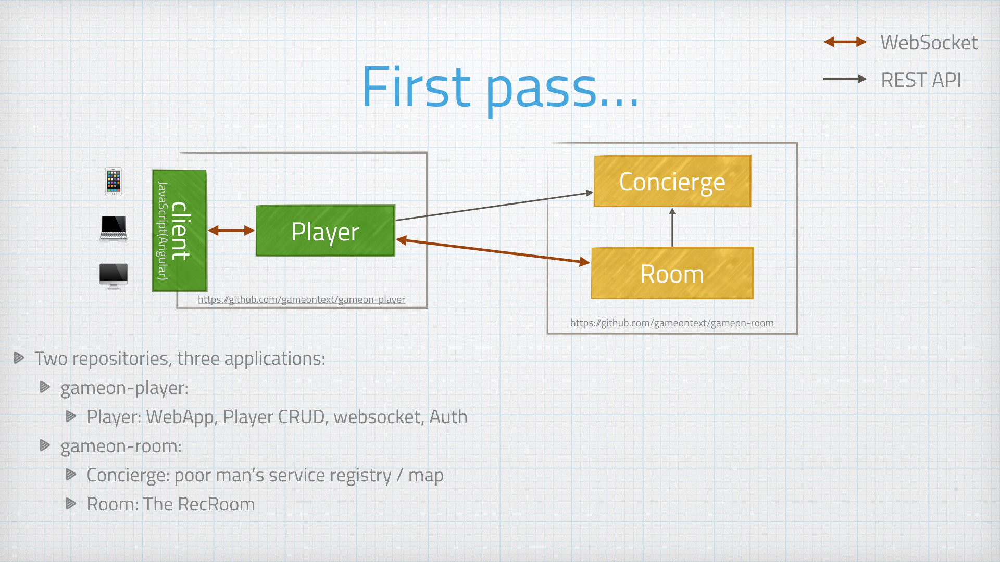

= The First Pass
:signedHeaders: link:../microservices/ApplicationSecurity.adoc
:WebSocketProtocol: link:../microservices/WebSocketProtocol.adoc
:game-on: https://gameontext.org/

Our first attempt was typical stand-things-up-in-a hurry hacking. This was a bit
of a hybrid: we did start this as separate runtime services, but they were built
in more monolithic chunks.

At this early early stage, it was a bunch of us (Java developers) standing these
services up on our local machines. We were able to share code (thank you git), but
relied on gradle and and local WDT dev/test environments to make progress without
having these services deployed out into cloud-space.

The API between Concierge and Room was changing all the time in the early days,
so having those two services built in the same repository made things easier as
we kept changing our minds about how we wanted these two services to interact.

The Player service in this pass was also multifunction, serving the web
front end, acting as the authenticator, and acting as the mediator between the
player's device and the target room.
