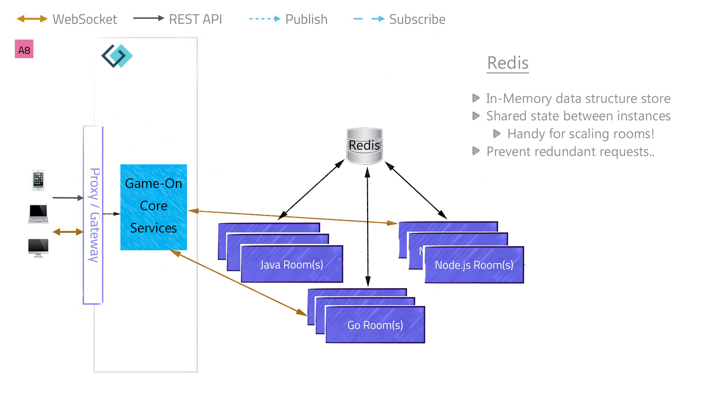

= Marco? Polo, Polo, Polo, Polo. (Caching).
:icons: font
:game-on: https://gameontext.org/
:redis: https://redis.io/
:redis-compose: https://console.ng.bluemix.net/catalog/services/compose-for-redis/
:redis-cloud: https://console.ng.bluemix.net/catalog/services/redis-cloud
:jedis: https://github.com/xetorthio/jedis
:jsr107: https://dzone.com/articles/introduction-jcache-jsr-107
:jsr107redisson: https://dzone.com/articles/jcache-api-jsr-107-implementation-for-redis
:jsr107annotations: http://gregluck.com/blog/archives/2014/04/how-to-use-jsr107-caching-annotations/
:jsr107annotationRI: https://github.com/jsr107/RI/tree/master/cache-annotations-ri
:ppap: https://www.youtube.com/watch?v=Ct6BUPvE2sM
:bdjsr107: https://github.com/BarDweller/JSR107-RI-CDI-Redisson-Bluemix
:redisson-jcache-config: https://github.com/redisson/redisson/wiki/14.-Integration%20with%20frameworks#143-jcache-api-jsr-107-implementation
:rediscloud-vcap: https://docs.run.pivotal.io/marketplace/services/rediscloud.html#bind-service
:redisson-chat: https://gitter.im/mrniko/redisson
:redisson-3-2-4: https://github.com/redisson/redisson/blob/master/CHANGELOG.md
:bdcache: https://github.com/BarDweller/JSR107-RI-CDI-Redisson-Bluemix/blob/v1.0.7-STILETTO/cache-annotations-ri/cache-annotations-ri-common/src/main/java/org/jsr107/ri/annotations/DefaultCacheResolverFactory.java
:jitpack: https://jitpack.io
:redisroom: https://github.com/BarDweller/gameon-jsr107-room
:jsr107lock: https://github.com/BarDweller/gameon-jsr107-room/tree/master/src/main/java/org/gameontext/sample/jsr107lock
:jsr107box: https://github.com/BarDweller/gameon-jsr107-room/tree/master/src/main/java/org/gameontext/sample/jsr107box
:jsr107secret: https://github.com/BarDweller/gameon-jsr107-room/tree/master/src/main/java/org/gameontext/sample/jsr107secretCache
:jsr107toggle: https://github.com/BarDweller/gameon-jsr107-room/tree/master/src/main/java/org/gameontext/sample/jsr107toggle
:jitpack: https://jitpack.io/

Time passed... the grue failed to eat us. So we decided to look into Caching.

## Overview.

There are places in the Game On code where we request data "service to service" and don't expect that data to change very often.
Additionally, some of the places we request data from, have limits imposed (no more than x requests within y time period).
To combat this, we added some of our own little Caches into the code to store the replies, so we didn't need to make too
many repeat requests.

But 'some of our own little Caches' are of course unique to each service instance and if the instance scales to multiple instances,
we end up with multiple caches. With each storing their own views of what they have seen. Clearly this was not ideal.

So we knew we needed to look at something like.. Redis!

## Redis

{redis}[Redis] bills itself as "an in-memory data structure store, used as a database, cache, and message broker". Which sounds pretty shiny, especially as our favorite Cloud hosting provider Bluemix has not {redis-compose}[one] but {redis-cloud}[two] Redis based offerings to play with.

The general idea is that instead of having your caches individually within each service instance, you hold them within a
remote service where the cache is shared, populates faster and take less memory per service. This allows you to gain interesting new
abilities from a service perspective.

## Interfaces

We originally planned to look at talking to Redis via {jedis}[Jedis] (which I'm totally torn about if I should pronouce 'jed-diss' to rhyme with 'Red-diss', or 'Jed-eyes' because, lightsabers.) But then thought we should investigate if Java had any sort of Caching standard, and discovered .. JSR107.

{jsr107}[JSR107] is a set of interfaces and annotations that attempt to provide a standards based way to do caching, while the actual cache is implemented by something else. Which lead to the obvious question, "Can I talk to Redis via JSR107?". If you're anything like me, you hit Google, ran a search, and declared "Ooh, there's this Redisson thing that claims to offer {jsr107redisson}[JSR107 for Redis in Java]".

A little more research and soon you're deep into the world of standards, open source, and other exciting stuff. The TLDR message
that you come away with for JSR107 is, that it is not all that simple. It comes in two parts, firstly the Java interfaces and classes,
and secondly the annotations. The magic that makes the annotations work is {jsr107annotations}[supposed to be supplied by the container the spec isimplemented by], eg, CDI. But because JSR107 is not part of a released JEE spec yet, CDI containers have yet to implement that magic.

Redisson's JSR107 support goes as far as implementing the interface side of stuff and then goes on to suggest,
"Your container will do the rest". Except it doesn't. Yet.

Thankfully, the Reference Implementation (RI) realized that encouraging adoption of a spec when there's no implementation available,
is a tough cookie to break, and it comes with a {jsr107annotationRI}[set of modules] that enable the annotations in various containers, one of which is CDI.

## Hackery

So I figure...  I have a RI CDI Annotation Implementation, I have a JSR107 compliant implementation...  uh..  {ppap}[Pineapple Pen]!

After a brief moment of therapy and sanity returned, I {bdjsr107}[created a fork] of the RI that had just the CDI annotation logic and Redisson as a dependency. After some faffing with beans.xml and CDI service extension files, I eventually got the whole thing to fire up, only to die with a little message saying I'd failed to provide the required configuration file for Redisson's JSR107 implementation.

Redisson needs a {redisson-jcache-config}[config file] to tell it how to connect to Redis (amongst other things), and because JSR107 is implementation agnostic, JSR107 doesn't really provide a handy way to say 'I want JSR107, but I want it to talk to Redis'.. the hook point between the two is unfortunately just a URI. I say unfortunately, because the examples talk of a fixed name config file, or a config file to be pointed to by the URI and that file would have info like the Redis server, port, and password. But I'm going to run in Bluemix where the Redis information is supplied to the container {rediscloud-vcap}[via the VCAP_SERVICES environment variable] and I didn't look forward to try to parse the JSON from that environment variable and into a Redisson Config file.. There had to be a better way..

I had a nice {redisson-chat}[chat with the Redisson developers]
), and yes, there is a way to programattically configure a JSR107 Cache instance to use Redisson, just they hadn't really considered why people would need it, with a little help from them, I had a viable way to make this work. (_Update, {redisson-3-2-4}[Redisson 3.2.4] has released with proper support for using Redisson config during JCache cache creation_) I made a few tweaks to the forked CDI annotation layer so that {bdcache}[when it obtained its default cache manager], it would do so via my own VCAP_SERVICES configured Redisson.. and bam.. {ppap}[Pen Pineapple Apple Pen.]

## Using all the toys

From that point, I had a working JSR107 implementation to use, and via the magic of {jitpack}[jitpack], I could use it directly as a dependency in a sample room.. Why not add it directly to the Game On core services? Because it is a lot easier to test JSR107 outside of the core and to have a play to get a feel how it all worked.

In {redisroom}[that room], I managed to implement a {jsr107lock}[basic cached based lock], {jsr107box}[cached based inventory] (room, boxes), and {jsr107secret}[caches with timeouts], and {jsr107toggle}[caches with cache listeners].

Along the way, I learned that Redis servers have connection limits and that you probably shouldn't create a new Redisson client
every time your annotations are processed. Otherwise, you may run out of connections surprisingly quick. Instead, I'm using a static
instance, which seems to work out fine.

Expect to see the JSR107 stuff turn up via Advanced Adventures in the future =)
