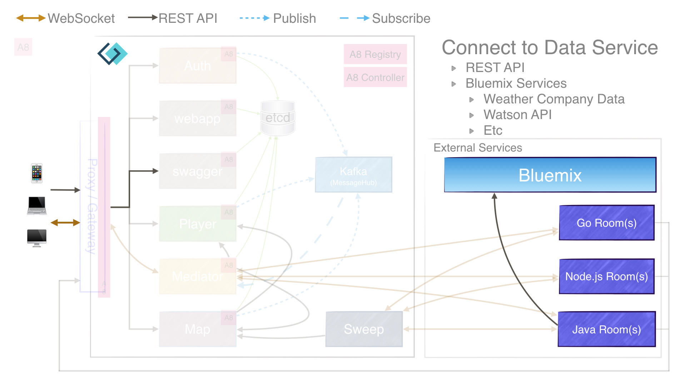

= Weather Room (Interacting with REST API service)
:icons: font
:signedHeaders: link:../microservices/ApplicationSecurity.adoc
:WebSocketProtocol: link:../microservices/WebSocketProtocol.adoc
:game-on: https://gameontext.org/
:java-sample: https://github.com/gameontext/sample-room-java#introduction
:weather-room: https://github.com/rstephenrrtx/weather-room-java

{game-on}[Game On!] is desgined as a fun way to explore microservices, right?  So our rooms
are the microservice and we can write some puzzles, etc for them.  But shouldn't
room vistors be able to interact with other microservices?  Maybe outside of
{game-on}[Game On!]?

I'm re-learning some programming techniques after being on the operations side
of things for quite a long time.  So I was excited, challenged, and a little
scared to start programming again.  Where to start?  Well how about at the
beginning with the {java-sample}[Java sample room]?

While that was a good way to become familiar with the build process, docker,
bluemix and other technologies, I wanted to create a room to interact with
something.  As I stared blankly at my office wall I asked myself:

 "What's the weather like?"

You can see my {weather-room}[in-depth code walkthrough] as I take that simple
question and use it to design a room that will tell you the current weather
conditions in your favorite US zip code.  Using a REST API call to interact with
IBM Weather Company service on Bluemix seemed like a good way to

* Write my first microservice
* Write my first program to interact with another service
* Have a little fun with the messages displayed

I've written many applications over the years but most of those were pretty
stand-alone (databases not included).  I see the advantage of writing a small
microservice to process requests.  I hope you can learn a little here.
