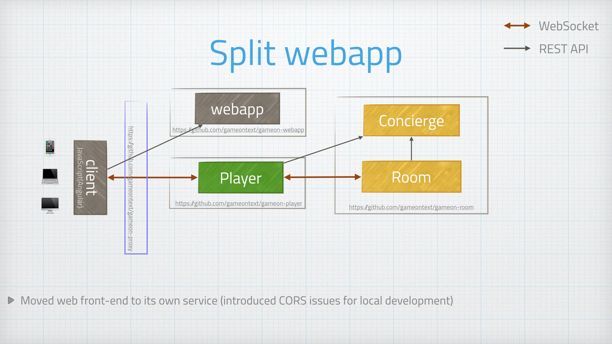

= Freeing the Front-End
:icons: font
:signedHeaders: link:../microservices/ApplicationSecurity.adoc
:WebSocketProtocol: link:../microservices/WebSocketProtocol.adoc
:game-on: https://gameontext.org/

We have a few Kate's on the team, and one of them is an avowed
FED (that's a Front-End Developer, not a federal employee). She was
happy to work on improving our front end web application, but really,
she couldn't care less about Java. We realized, in fact, that there
was no good reason to keep making her care about Java.

We therefore split the web stuff into its own (small, simple) container,
using nginx to serve the static content. Kate was now happily able to
work at her own rate and pace on FED things without having to do
much of anything with the Java bits. Hooray!

Introducing this sadly had the added 'bonus' of requiring CORS headers
for local development, which was a pain. The live site was saved this
nonsense by the proxy, which created a single domain namespace for all
of the various backend services.

We added CORS filters to the app for the time being and moved on.

As a sidenote, we did alleviate this later by also using a proxy
locally. We could also have addressed this using xip.io to create a
locally consistent domain, but for that to work, you would need to have a
live internet connection so the xio.io domain to resolve. Some of us
are those crazies that work on planes that don't have wifi ...
