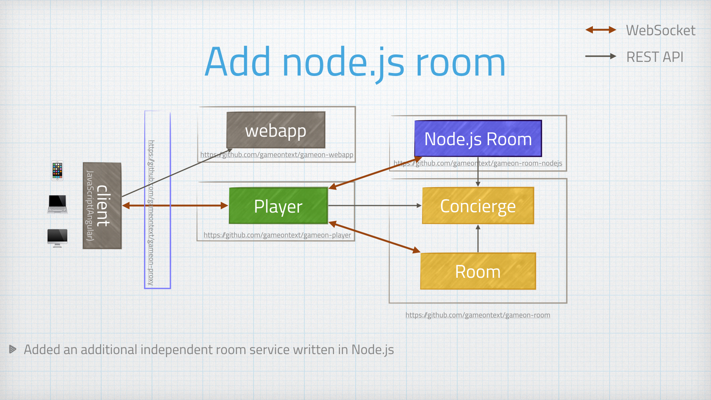

= Something other than Java!
:icons: font
:signedHeaders: link:../microservices/ApplicationSecurity.adoc
:WebSocketProtocol: link:../microservices/WebSocketProtocol.adoc
:game-on: https://game-on.org/

Our team has nothing against JavaScript, but Java is what we know. When attempting
something big and new, we felt it usually good idea to constrain the number of
moving parts in the air at once. In this case, we stuck with a language we were
familiar with for the core services.

The Node.js room brought JS to the backend. More will follow.
