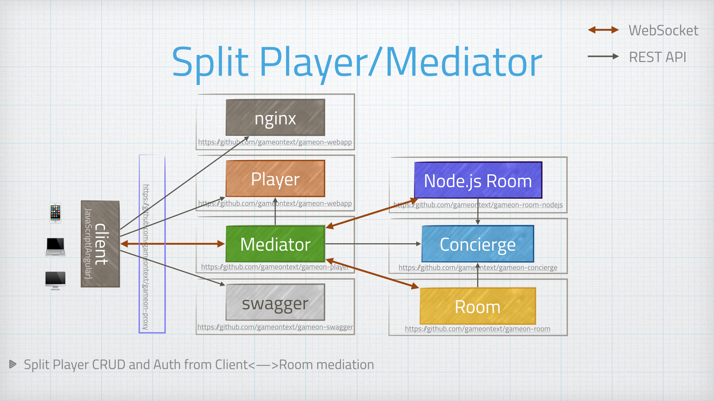

= Breaking down the Player service
:icons: font
:signedHeaders: link:../microservices/ApplicationSecurity.adoc
:WebSocketProtocol: link:../microservices/WebSocketProtocol.adoc
:game-on: https://gameontext.org/

Over time, the Player service, which was filling multiple roles, felt more and
more out of place. It was already cut down once, when we moved the webapp out,
but as we resolved some websocket traffic management issues in the mediator,
it became clear that we had two very different work patterns within the same service,
one dealing only with CRUD operations, and one wielding data flowing over
long-running connections. The two workloads have fundamentally different behaviors and
scaling characteristics, and should not be housed in the same service.

So we exploded the formerly-known-as-Player-service into:

* The (new) Player service (even if we keep the auth and player datastore together) is
REST-only, with short-lived operations with well understood load/scaling characteristics.

* The Mediator service, which performs the task of mediating between long-running
WebSocket connections. The connection between the browser and the mediator is active
as long as the player is connected. The mediator then manages creating and destroying
connections to rooms (other services) as players move around. Scaling characteristics
here are harder to determine, as there are usually two long-running WebSocket connections
established for each active player.

Breaking the two pieces apart wasn't that difficult. The two pieces were built in
separate packages, and correctly treated internally as separate/isolated modules.
It was almost like we knew we would have to do this when we started...
