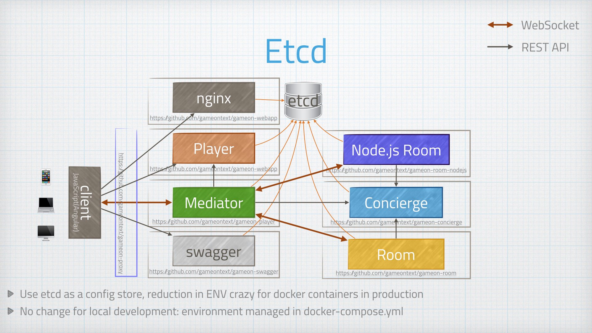

= Config management #FTW
:icons: font
:signedHeaders: link:../microservices/ApplicationSecurity.adoc
:WebSocketProtocol: link:../microservices/WebSocketProtocol.adoc
:game-on: https://gameontext.org/

So, at this point, we had a good fistful of services going through deployment
pipelines, and we were fresh from the effort of adding a new one (for mediator).
Managing environment variables across several build pipelines is a pain: lots of
clicking lots of boxes to get to lots of little perfect UI views.

We moved runtime environment variables particular to our production docker
environment out into etcd. This simplified what we needed to configure in our
build pipelines, and made it easier for containers to pick up new values when
they were restarted (no dynamic reconfiguration yet).
