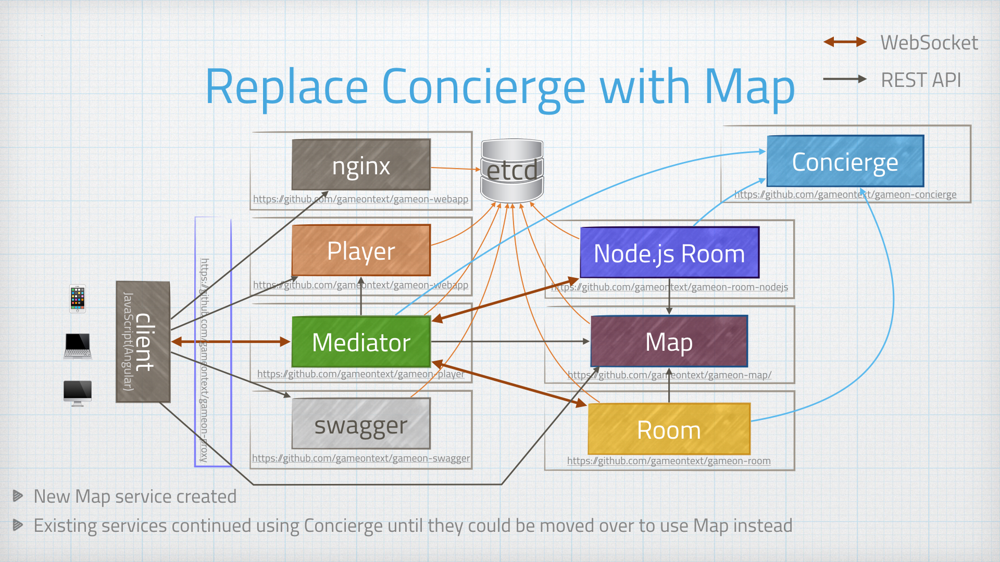

= Buh-bye to Concierge!
:icons: font
:signedHeaders: link:../microservices/ApplicationSecurity.adoc
:WebSocketProtocol: link:../microservices/WebSocketProtocol.adoc
:game-on: https://gameontext.org/

Concierge was such a cute service! It was supposed to help players find their
way from room to room. But it's name was confusing (was it a map or a traffic
director?). It's interaction pattern with mediator also introduced a single
point of failure: if the Concierge was down, the Players were pretty much stuck
wherever they were, with a fallback to First Room.

We designed a new Map service, with a much better API for adding and removing
rooms from the map. We built the new map service in place, alongside the Concierge
and other core services. Once the Map was up and stable, we started moving our
other services over to using Map instead, with Concierge still humming happily
along until its last consumer was cleaned up.
