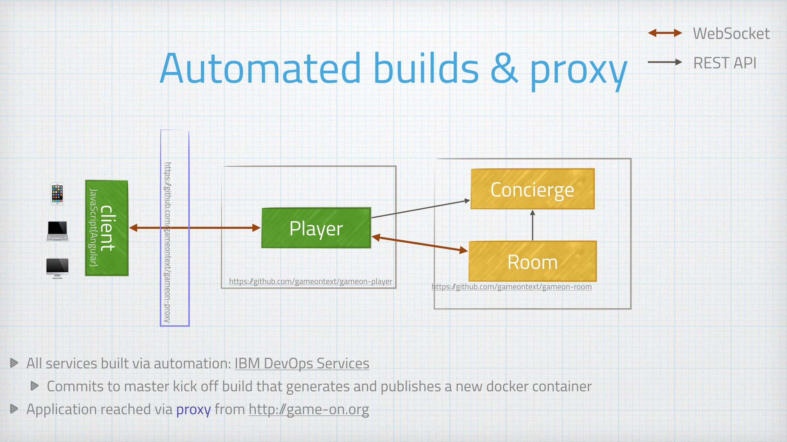
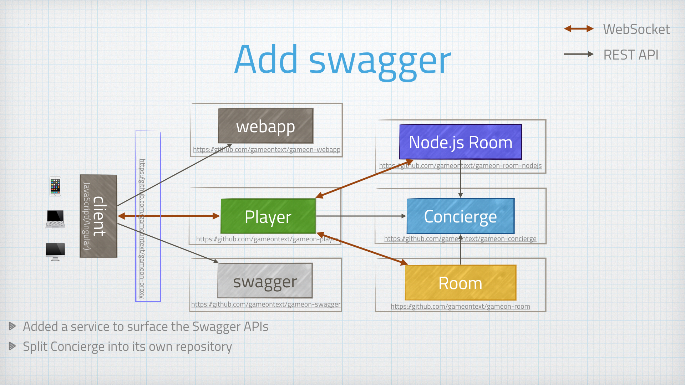
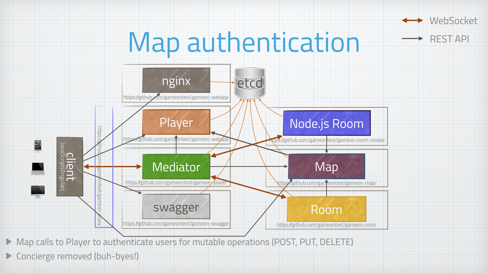
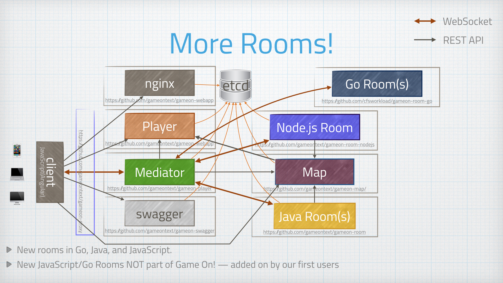

= Appendix: The Chronicles
:icons: font
:toc: preamble
:toc-title:
:toclevels: 1
:signedHeaders: link:../microservices/ApplicationSecurity.adoc
:WebSocketProtocol: link:../microservices/WebSocketProtocol.adoc
:game-on: https://game-on.org/

The following sections are more like a blog than a book. Creating a new
application from scratch using microservices is a messy business: documenting
the process is, in some respects, as important as showing the end result.

Given this is an opensource book, we invite you to contribute your own experiences
to this section.

== The first pass

image:../images/Progression.001.jpeg[Progression, width=95%]

Our first attempt was typical stand-things-up-in-a hurry hacking. This was a bit
of a hybrid: we did start this as separate runtime services, but they were built
in more monolithic chunks.

At this early early stage, it was a bunch of us (Java developers) standing these
services up on our local machines. We were able to share code (thank you git), but
relied on gradle and and local WDT dev/test environments to make progress without
having these services deployed out into cloud-space.

The API between Concierge and Room was changing all the time in the early days,
so having those two services built in the same repository made things easier as
we kept changing our minds about how we wanted these two services to interact.

The Player service in this pass is also multifunction: it is serving the web
front end, acting as the authenticator, and acting as the mediator between the
player's device and the target room.

== Automation and Cloud

Automated build pipelines arrived! and Docker containers out in the cloud!
Thankfully for those of us doing most of the dev work, the creation, testing of
the delivery pipeline was pretty transparent. The build pipeline is triggered by
a commit to the master branches of our repositories, which means no change to our
usual workflow.

A proxy was added to help route requests between the services and docker
containers, and to give us a seamless domain space ({game-on}[game-on.org]).

== Splitting out the web front-end

image:../images/Progression.003.jpeg[Progression, width=95%]

There is no good reason (and many not-good reasons) to have your web front end
packed in with a Java application. Freeing your front-end developers to be able
to develop and test without worrying about the Java gorp is a good thing.

We therefore split the web stuff into its own (small, simple) container. This had
the added 'bonus' of requiring CORS headers for local development, which was a
pain. In production, the proxy alleviated these issues: all of the services
belonged to the same domain.

This could be countered using xip.io, but for that to work, you still need to be
connected to the internet to allow the xio.io domain to resolve.

We added CORS filters to the app for the time being and moved on.

== Something other than Java!

image:../images/Progression.004.jpeg[Progression, width=95%]

Our team has nothing against JavaScript, but Java is what we know. When attempting
something big and new, we felt it usually good idea to constrain the number of
moving parts in the air at once. In this case, we stuck with a language we were
familiar with for the core services.

The Node.js room brought JS to the backend. More will follow.

== Explain it with panache

Swagger documentation!

Player and Concierge both have a REST API, and the Swagger container hosts and
serves the document that presents both APIs together in one view.

The bulk of the traffic flowing around in the game is over WebSockets, and that
is difficult for Swagger to document. For those interested in the real low-level
details, we wrote down and iterated on the WebSocket protocol in a Box note. The
result is documented {WebSocketProtocol}[here].

== Splitting up the Player service

image:../images/Progression.006.jpeg[Progression, width=95%]

Over time, the Player service, which was filling multiple roles, felt more and
more out of place. It was already cut down once, when we moved the webapp out,
but the mediator function was very complex, and will have different load/scaling
requirements at the end of the day.

* The Player service (even if we keep the auth and player datastore together) is
REST-only, which has fairly well understood load/scaling characteristics.
* The mediator function, on the other hand, is managing approximately two WebSocket
connections per connected user. Data will be flowing through the mediator in a
much different way.

Lots of reasons.

We did finally split the two functions apart, which was not difficult. They were
independent of each other, but happened to be built/packaged together in the same
app from within the same project. It was almost like we knew we would have to do
this when we started...

==  Bringing in etcd

image:../images/Progression.007.jpeg[Progression, width=95%]

So, at this point, we had a good fistful of services going through deployment
pipelines, and we were fresh from the effort of adding a new one (for mediator).
Managing environment variables across several build pipelines is a pain: lots of
clicking lots of boxes to get to lots of little perfect UI views.

We moved runtime environment variables particular to our production docker
environment out into etcd. This simplified what we needed to configure in our
build pipelines, and made it easier for containers to pick up new values when
they were restarted (no dynamic reconfiguration yet).

== Buh-bye to Concierge!

image:../images/Progression.008.jpeg[Progression, width=95%]

Concierge was such a cute service! It was supposed to help players find their
way from room to room. But it's name was confusing (was it a map or a traffic
director?). It's interaction pattern with mediator also introduced a single
point of failure: if the Concierge was down, the Players were pretty much stuck
wherever they were, with a fallback to First Room.

We designed a new Map service, with a much better API for adding and removing
rooms from the map. We built the new map service in place, alongside the Concierge
and other core services. Once the Map was up and stable, we started moving our
other services over to using Map instead, with Concierge still humming happily
along until its last consumer was cleaned up.

== Map Auth

We added {signedHeaders}[signed header-based security] to the Map service APIs.

== More Rooms!

Rooms written in Go, another room in JavaScript, and two more in Java. We learned
lots as other people were able to try adding their own rooms, especially as some
of them were trying to build their rooms while the Map/Concierge switch was in
flight. Ouch.

____
In the end, I realize that my experience was different from what a new developer
today would experience. We were building on shifting sand, they will be building
on a more stable API set. Too bad for them; building on sand was its own kind of
adventure game.
____

== Enter: The Sweep

image:../images/Progression.011.jpeg[Progression, width=95%]

Our first non-player character! The Sweep is in early days, so we don't know in
what directions it will grow, but it will serve an important function: keeping
the map alive and vital by pruning sick rooms.

== Go on Now, Go, Walk out the Door.. (don't turn around now)

image:../images/Progression.012.jpeg[Progression, width=95%]

As we started to see user created rooms added to the Map, we started to think about treating
our rooms like everybody else's. Up until this point, our rooms have cheated (a little),
as they've been able to directly talk to the core services. But no more! For we have kicked
the rooms out of the core services club, and told them they can no longer be members.

As with all recent 'exit' attempts, this one leaves the rooms still with the odd toe in the
core services pond, mumbling something about freedom of movement, and the fact we can't quite
yet bring ourselves to require yet another batch file to handle the launching of rooms.

Conceptually however, they are now very much split off. We hope they enjoy their banishment
and that they do not decide to rise up against us.

== None Shall Pass!

image:../images/Progression.013.jpeg[Progression, width=95%]

Remember way back in the beginning when we had only 3 services total and
the Player service did all the things that ever needed to be done regarding players?
Well, "all the things" included interacting with Social Login services to
authenticate the Player and issue an access token (JWT).

As we grew to support additional Social Login services, the dependency
management for Player become problematic. 3rd party libraries would require dependencies
that would conflict with others required by our core Player entity store function.
Can you believe it? We couldn't. As we looked more to the way that systems such as
KeyCloak, or Auth0 worked, it began to feel more natural to have a service dedicated
just to handling the issuing of JWTs in response to Social Login.

== Roll Up! Roll Up! See the Magical Events!

image:../images/Progression.014.jpeg[Progression, width=95%]

As the game evolved, we noticed there were some things there really isn't a
good way of handling with REST APIs. Reacting to events is a much more efficient
way of propagating changes through the system.  For example, when a
player changes their name via the Player service, it would be nice for that change
to ripple out to all interested parties so that interactions across devices can
be updated with the new username.

We decided to try using Kafka, or, when we run in BlueMix, MessageHub (which has a
Kafka interface, so essentially it's still Kafka to us).
As we looked more into Kafka we realised we can only allow our core services to
make use of it. While we would really like to make it generally accessible, it
wasn't really built to be internet facing (It only started
to add security at version 0.9). Maybe some day...

We wrapped our handling of receieved events into an RxJava based API, just by the way.

We're still in early days with our integration of Events, but the infrastructure is
all there waiting for us to use it.

== Marco! Polo!

image:../images/Progression.015.jpeg[Progression, width=95%]

An item long on our wishlist was to stop having hardcoded endpoint urls for our
services, it's not nice, and it will make it much harder to demonstrate service
instance scaling in future.

So steps in "Amalgam8", which sounds a little like something a Dalek might utter
if it were asked to interpret our architecture diagrams.

We're using Amalgam8 (A8) for it's service discovery and service proxying abilities.
Each of our core services registers as an A8 service, and has a sidecar added
to its container which acts as an in-container outbound proxy to other services.

Thus now, when Mediator wishes to talk to Map to discover which room is behind an
Exit, it no longer talks to a fixed remote endpoint configured via etcd, but instead
talks to its in-container proxy, asking for the Map service via a known local url.

A8 then handles connecting the request to the correct service instance running in
another container. 
