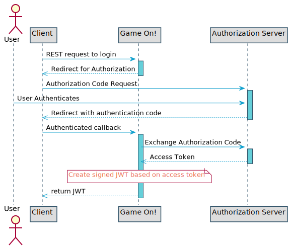

= Application Security
:icons: font
:toc:
:toc-title:
:toc-placement: preamble
:toclevels: 3
:swagger: https://gameontext.org/swagger/
:hmac-rfc: http://www.ietf.org/rfc/rfc2104
:jwt-java: https://github.com/jwtk/jjwt
:jsrsasign: http://kjur.github.io/jsrsasign/
:jwt-struct: http://jwt.io/introduction/
:jwt-rfc: https://tools.ietf.org/html/rfc7519
:game: link:../game_play.adoc
:signed-repo: https://github.com/gameontext/signed/releases

Game On! has the following general security requirements

. Identify the user.
. Prevent data alteration in transit.
. Prevent replay attacks.

We satisfy these requirements using a combination of OAuth protocols, JSON Web
Tokens (JWTs) and API keys.

== OAuth and OpenID Connect for Player Identification

While the game has a notion of a Player, we decided to opt-out of the password
management business. Game On! relies on third-parties for user identification.
When you play the game, you authenticate with an OAuth provider (Facebook,
GitHub, Google, Twitter). After you have authenticated with the third party,
we create a signed JWT that we then use to identify you.

== JSON Web Tokens (JWT)

[quote, "IETF RFC 7519", {jwt-rfc}]
____
JSON Web Token (JWT) is a compact, URL-safe means of representing
claims to be transferred between two parties.  The claims in a JWT
are encoded as a JSON object that is used as the payload of a JSON
Web Signature (JWS) structure or as the plaintext of a JSON Web
Encryption (JWE) structure, enabling the claims to be digitally
signed or integrity protected with a Message Authentication Code
(MAC) and/or encrypted.
____

Phew! That was dense, but hopefully understandable.

Game On! typically uses JWTs to authorize actions on behalf of the user. The JWT
standard contains headers for identifying the user and the actions they are
entitled to perform e.g. delete a resource or register a new end point. The use
of signed JWTs allows services to be sure that the token has not been modified
as it is passed from service to service.

JWTs are created and signed according to the method described in the "Which is
the JSON Web Token Structure" section of the {jwt-struct}[introduction to JWTs]
at http://jwt.io.

The claims used as those specified by {jwt-rfc}#section-4.1[Section 4.1 of
RFC 7519, Registered Claim Names].

Note: Unless otherwise stated, Game On! uses *RSA-256* as the signature algorithm.

=== References

* Testing your JWT : http://jwt.io/#debugger-io
* Browser JS for working with JWT's, {jsrsasign}[{jsrsasign}]
* Server side JTW processing with JJWT : {jwt-java}[{jwt-java}]
* JSON Web Token RFC : {jwt-rfc}

== Signed Requests

Signed requests are used to validate and authorize service-to-service API
invocation. Trust is achieved through the use of a shared secret to create a
signature that can be used to verify that request data did not change in
transit, as decribed in {hmac-rfc}[RFC 2014 - Keyed-Hashing for Message
Authentication].

We've created a {signed-repo}[library] (currently only in Java), to
help with managing signed requests. The https://github.com/gameontext/signed[README]
explains how to make use of this library in your services.

=== HTTP Elements used to Sign a Request

A signed request can be sent to Game On! using HTTP headers, as part of the
query string or a combination of both. Duplicate entries will be treated as an
invalid request. The following table lists the values that need to be supplied
when signing your request.

[NOTE]
====
Unless otherwise stated, Game On! uses the *SHA-256* algorithm to
generate or validate hashes.
====

[cols="4*"]
|===
|Name
|Description
|Required
|Notes

|*gameon-id*
|Your user id
|Required
|Your user id (different than your user name) is found on the
{game}#user-profile[user profile page].

|*gameon-date*
|Creation time and date
|Required
|This should be a UTC date/time in one of the accepted
http://www.ietf.org/rfc/rfc2616[RFC 2616 formats]

|*gameon-signature*
|HMAC Signature to be validated
|Required
|The signature is a case-insensitive hex string generated using the
<<hmac-generation,steps outlined below>>

|*gameon-sig-headers*
|A semi-colon delimited list of HTTP header names, followed by a hash of
  the values for the listed headers.
|Varies per operation
|See the API documentation for a list of headers to include in the signature.
Do not include ** gameon-* ** headers.

|*gameon-sig-params*
|A semi-colon delimited list of query parameter names, followed by a
  hash of the values for the listed parameters.
|Varies per operation
|See the API documentation for the list of query parameters to include in the
signature. Do not include ** gameon-* ** parameters.

|*gameon-sig-body*
|Hash of the contents of the request body.
|Required for POST and PUT requests
|Ensures that JSON sent to the server has not been modified in transit.

|===

[[hmac-generation]]
=== Constructing a Signed Request

These steps work against the set of headers being constructed for the
request message:

. Add the **gameon-id** header with your public API key as its value.
. Add the **gameon-date** header with the the current time and date in UTC
  (RFC 1123 format) as its value.
. If the **gameon-sig-headers** header is required, add it with a
  <<multi-value-hash, hash generated using HTTP headers>> as a value.
. If the **gameon-sig-params** header is required, , add it with a
  <<multi-value-hash, hash generated using query parameters>> as a value.
. If there is a request body, add the **gameon-sig-body** header with the
  hash of the request body as a value.
. Add the **gameon-signature** header:
.. Initialize a HMAC-SHA256 function using your shared secret.
... Update with the request method, e.g. GET, POST, etc.
... Update with the requested URI, not including query parameters,
   e.g. /map/v1/sites
... Update with the value of **gameon-id**
... Update with the value of **gameon-date**
... Update with the value of **gameon-sig-headers** (if present)
... Update with the value of **gameon-sig-params** (if present)
... Update with the value of **gameon-sig-body** (if present)
.. Generate the HMAC and convert it to lowercase hex, and use the result as the
   value.

[[multi-value-hash]]
==== Constructing a hash for elements with multiple values

When constructing the value for **gameon-sig-headers** or **gameon-sig-params**,
use the following steps:

. Start with a semi-colon separated list of required element names,
  e.g. `A;B;C;`
. Append the a hash constructed from the values of named elements
** The hash should include the value of each required element in the order it
   appears in the list of element names
** If there are multiple values for a header, concatenate them in the order
   they appear with no separator: `value1value2value3`

Example value: `A;B;C;<hash of values for A, B, C>`

==== Examples of Signed Requests

The following are examples only of how headers and query strings are combined
to create signed requests. API Documentation will describe which operations
must be signed, and how.

Assuming a shared secret of `fish`, you should be able to reproduce the
signature in the following examples using the algorithm above.

1) A signed GET request, with no extra headers

----
GET /map/v1/sites/aRoomId HTTP/1.1
gameon-id: MyUserId
gameon-date: Sat, 21 May 2016 19:14:54 GMT
gameon-signature: mYsWeiZm9oyUmJXo1uCwq1AHoHSm5eLrblU9q35EjOU=
----

2)  A signed POST request which includes the JSON body content, but no other
headers.

----
POST /map/v1/sites HTTP/1.1
gameon-id: MyUserId
gameon-date: Sat, 21 May 2016 19:14:54 GMT
gameon-sig-body: AWRN0wv343B7k7Ucp1sipeM2U9hZLVlMzPNA6uUiyug=
gameon-signature: jblpGaN8bjd4SmhsK341EP1x7e2w8sZ3L1T64YB+mrQ=
Content-Type: application/json
Content-Length: 12

{id: 'test'}
----

3) A signed POST request that includes JSON body content and headers

----
POST /map/v1/sites HTTP/1.1
gameon-id: MyUserId
gameon-date: Sat, 21 May 2016 19:14:54 GMT
gameon-sig-headers: Content-Type;Content-Length;47DEQpj8HBSa+/TImW+5JCeuQeRkm5NMpJWZG3hSuFU=
gameon-sig-body: AWRN0wv343B7k7Ucp1sipeM2U9hZLVlMzPNA6uUiyug=
gameon-signature: 3E3+YFH6qd30WlujaOellykNWxH0AOMecFvuHyYV42k=
Content-Type: application/json
Content-Length: 12

{id: 'test'}
----

4) A signed GET request with parameters

----
GET /map/v1/sites?owner=MyUserId HTTP/1.1
gameon-id: MyUserId
gameon-date: Sat, 21 May 2016 19:14:54 GMT
gameon-sig-params: owner;HkP19XXoI90rtg6yWMTACQ20rWZQhbGmgFDMjHSU2qg=
gameon-signature: bb0otJw4jDitSf7DXNWMjQEwsoaZqjXlSrE8Wkvkf6s=
----

[[hmac-parsing]]
=== Parsing Signed Requests

Signed requests should be validated as followed. A response with a 404 return
code should be returned if any of the following checks fail.

. Compare the **gameon-signature** value to those from recently seen requests
  to protect against replay attacks. Minimally, non-idempotent methods
  (e.g. POST) should be checked, but others can as well.
. Examine the value of **gameon-date** and ensure it is less than 5 minutes old
. Examine the value of **gameon-id** and ensure that it is valid and has
  not been revoked.
. Examine the value of **gameon-sig-headers** (if present)
.. Generate a
   <<multi-value-hash, new hash from the specified HTTP header values>>
.. Verify that the new hash value matches the hash value in the header.
. Examine the value of **gameon-sig-params** (if present)
.. Generate a
   <<multi-value-hash, new hash from the specified query parameter values>>
.. Verify that the new hash value matches the hash value in the header.
. Examine the value **gameon-sig-body** (if present)
.. Generate a new hash from the request body
.. Verify that the new hash value matches the value in the header.
. Examine the value of the **gameon-signature** header:
.. Initialize a HMAC-SHA256 function using the shared secret associated with
   the **gameon-id**. The shared secret confirms the identity of the sender.
... Update with the request method, e.g. GET, POST, etc.
... Update with the requested URI, not including query parameters,
   e.g. /map/v1/sites
... Update with the value of **gameon-id**
... Update with the value of **gameon-date**
... Update with the value of **gameon-sig-headers** (if present)
... Update with the value of **gameon-sig-params** (if present)
... Update with the value of **gameon-sig-body** (if present)
.. Generate the HMAC and convert it to lowercase hex, compare this value to
   the value of the **gameon-signature** header.

=== Signing WebSocket requests (Mediator to room)

WebSockets are just upgraded HTTP connections, so we can use the same general mechanics
as above to sign WebSocket requests.

A unique aspect of this application is that the central services of the game are
calling out to your rooms: it is likely that you would want to make sure it is
the game calling your room, and not an unknown party.

One of the things you can provide when registering your room is a token. If a
token is present, we will create an hmac signature for the request using the
following procedure:

. Add the **gameon-date** header with the the current time and date in UTC
  (RFC 1123 format) as its value.
. Add the **gameon-signature** header:
.. Initialize a HMAC-SHA256 function using the shared token.
... Update with the requested URI, not including query parameters, e.g. /ws/room
... Update with the value of **gameon-date**
.. Generate the HMAC and convert it to lowercase hex, and use the result as the
   value.

When your room receives the signed request to initiate the WebSocket connection,
verify the signature. Then create a new signature in the response
built from the signature in the request and a new date:

. Add the **gameon-date** header to the response with the the current time and
  date in UTC (RFC 1123 format) as its value.
. Add the **gameon-signature** header to the response:
.. Initialize a HMAC-SHA256 function using the shared token.
... Update with the value of **gameon-date**
... Update with the value of **gameon-signature** from the request headers
.. Generate the HMAC and convert it to lowercase hex, and use the result as the
   value.

The Mediator will verify that signature as part of the handshake to establish
the connection.

=== References

. Keyed-Hashing for Message Authentication : {hmac-rfc}
. Standard HTTP headers and well known non-standard ones :  https://tools.ietf.org/html/rfc7235
. How to define custom HTTP headers : http://tools.ietf.org/html/rfc6648
+
A quick note about custom HTTP headers. Originally it was recommended that custom
headers start with x-, so this is why you see headers such as x-api-key and x-amz-date.
However in the latest RFC, this has been changed to say that you should use
something meaningful, and it no longer needs to be prefixed with x-. If you want
to avoid potential name space clashes then try and use something unique to your
application or organization (e.g. gameon-, in our case).
