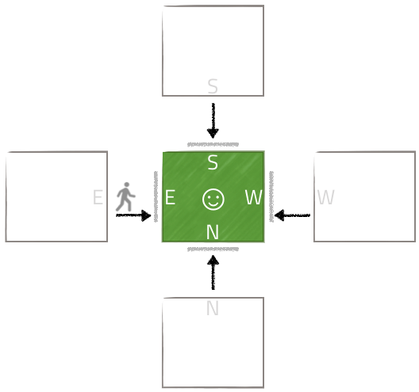
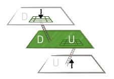

= The Map
:icons: font
:toc:
:toc-title:
:toc-placement: preamble
:toclevels: 2
:12-factor: link:../about/12-factor.adoc
:security: link:ApplicationSecurty.adoc
:swagger: https://gameontext.org/swagger/
:repo: https://github.com/gameontext/gameon-map

The Map is one of the game's core services. It is implemented in Java using
WebSphere Liberty. The source is {repo}[available on GitHub]. The public REST API
is {swagger}[browsable with Swagger]. What follows is a very
description of how the internals of the map service work.

== API, Language, and Runtime

The Map is a Java-based service. It uses Java 8, and relies on Java EE 7
technologies like JAX-RS 2.0.

We built the Map using WebSphere Liberty, in a Swagger-first manner using
Liberty's `apiDiscovery-1.0` feature. Swagger annotations were added to
JAX-RS resources and POJOs, with the set being refined until the API was
consistent. The annotated POJOs are then shared between API requests and
DB interactions.

== NoSQL DataStore

The Map uses couchdb when running locally in docker containers, and Cloudant
when running in Bluemix.

The ektorp library is used to interact with either backend, consistent with
the replaceable-services aspect of {12-factor}[twelve factor applications].

== Maintaining the grid

The Map uses a 2-dimensional grid containing all known (both registered and
empty) rooms. It ensures that registered rooms have neighbors to the North,
South, East and West. It ignores Up and Down.

First Room has type `room`, but is primordial. It is always at (0,0).

== Map documents

`Site` documents are used to represent a position in the grid.

.Site (abridged) as a NoSQL JSON Document
----
Site {
  id: <generated>
  type: room | empty
  coord: { x: <assigned>, y: <assigned> }
  owner: <set when room assigned, unset for empty>
  info: <room information, only present for assigned rooms>
}
----

There are two types of sites: `empty`, for unassigned sites, and `room`, for
assigned sites.

When returned from Map operations, a `Site` contains additional generated data
describing exits.

=== Room Registration

The room registration API expects a JSON structure describing the room
as a parameter. This includes connection details and descriptions of the room's
doors.

.JSON structure for room information, provided when a room is registered.
----
{
  "name": "terseName",
  "connectionDetails": {
    "type": "websocket",
    "target": "wss://reachable.host:9080/barn/ws",
    "token": "optional-token-for-identification"
  },
  "fullName": "A descriptive name",
  "description": "Describe your room. This is shown in full when the player enters.",
  "doors": {
    "n": "The outside of the room for a player traveling north",
    "w": "The outside of the room for a player traveling west",
    "s": "The outside of the room for a player traveling south",
    "e": "The outside of the room for a player traveling east",
    "u": "The outside of the room for a player traveling up",
    "d": "The outside of the room for a player traveling down"
  }
}
----

== The Nature of Doors

A door is a description, as seen from the outside of the room. The east door
(e) description should describe how a player traveling east will approach your
room.

.Describe the doors for your room (in green) from the point of view of the navigating player.

The example below shows the descriptions of the doors for First Room, which
avoids any mention of direction in its door descriptions, though they are all
consistent in theme.

.Site document for First Room
----
{
  "_id": "firstroom",
  "_rev": "3-67cf483ff7099f9c7721caf9563a350d",
  "owner": "game-on.org",
  "info": {
    "name": "First Room",
    "connectionDetails": null,
    "fullName": "The First Room",
    "description": "A helpful room with doors in every possible direction.",
    "doors": {
      "n": "A knobbly wooden door with a rough carving or a friendly face",
      "w": "A fake wooden door with stickers of friendly faces plastered all over it",
      "s": "A warped wooden door with a friendly face branded on the corner",
      "e": "A polished wooden door with an inlaid friendly face",
      "u": "A scuffed and scratched oaken trap door embossed with a friendly face",
      "d": "A rough-cut particle board hatch with a friendly face scratched on it"
    }
  },
  "coord": {
    "x": 0,
    "y": 0
  },
  "type": "room"
}
----

In the game, if I `/go N` from First Room, and get the `/exits`, this
is the result:

----
Visible exits:
(S)outh	 A knobbly wooden door with a rough carving or a friendly face
(E)ast	 A shiny metal door, with a bright red handle
(W)est	 An overgrown road, covered in brambles
(N)orth	 A winding path
----

Note that the south exit uses the north door description from First Room!

=== Finding Neighbors

The map uses a view that shows a site's neighbors in two ways:

* To generate the list of exits when a Site is retrieved
* To ensure that assigned sites have neighbors on all 4 sides to make
  navigating assigned rooms easier.

Queries for neighbors are made using the site's coordinates.

.CouchDb / Cloudant view to identify neighbors
[source,javascript]
----
function(doc) {
  if ( doc.coord ) {
    emit([doc.coord.x, doc.coord.y, "0", doc.type], null);
    emit([(doc.coord.x + 1), doc.coord.y, "W", doc.type], {"_id": doc._id});
    emit([(doc.coord.x - 1), doc.coord.y, "E", doc.type], {"_id": doc._id});
    emit([doc.coord.x, (doc.coord.y + 1), "S", doc.type], {"_id": doc._id});
    emit([doc.coord.x, (doc.coord.y - 1), "N", doc.type], {"_id": doc._id});
  }
}
----

That there is crazy, right? But it does some magic. Every site adds itself at
its own coordinate, and as a directional neighbor. So First Room, which lives
at (0,0), shows up in the index 5 times: [0,0,"0", "room"], [0,1,"W", "room"],
[0,-1,"E", "room"], [1,0,"S", "room"], and [-1,0,"N", "room"]. This allows
First room to show up as a neighbor when we query using that neighbor's
coordinates.

To carry on with the example above, we can query for the room to the North of
first room using its coordinates.

.Query for the room North of First Room (0,1)
----
GET /map_repository/_design/site/_view/neighbors?startkey=[0,1,"A"]&endkey=[0,1,"Z"]&reduce=false
----

.Results for the room to the North of first room (0,1)
----
{"total_rows":205,"offset":124,"rows":[
{"id":"930e061600bcda3f8e6fab2e8e31821e","key":[0,1,"E","room"],"value":{"_id":"930e061600bcda3f8e6fab2e8e31821e"}},
{"id":"3a105f914083ab6d37d043d22bb6380d","key":[0,1,"N","room"],"value":{"_id":"3a105f914083ab6d37d043d22bb6380d"}},
{"id":"firstroom","key":[0,1,"S","room"],"value":{"_id":"firstroom"}},
{"id":"e6902c3b11c1fe3b813f16e3a5875b94","key":[0,1,"W","room"],"value":{"_id":"e6902c3b11c1fe3b813f16e3a5875b94"}}
]}
----

And there it is in the results, First Room is the southern neighbor.
If we include the associated documents when we make this query (as we do),
then we have all the information that we need to generate the exits for the
room at (0,1).

=== Empty Rooms

One of the challenges of maintaining the map is keeping allocated sites centered
around First Room (the origin of the map). We do this using a two step process.

The first step uses a view that specifically lists only empty sites.

.CouchDb / Cloudant view of emtpy sites
[source,javascript]
----
function(doc) {
  if ( doc.coord && doc.type == "empty" ) {
    var sort = Math.abs(doc.coord.x) + Math.abs(doc.coord.y);
    emit([sort, doc.coord.x, doc.coord.y], doc);
  }
}
----

If the document is a site (it has a coord element), and it has an `empty` type,
then the site is added to the view with a complex index that includes a sort
order based on the absolute value of its individual coordinates.

.Query for empty sites
----
GET /map_repository/_design/site/_view/empty_sites
----

.Results for Empty sites
----
{"total_rows":16,"offset":0,"rows":[
{"id":"dbeb1d6296737412f364ca0c5ba49ccc","key":[4,-4,0],"value":{...},
{"id":"bd3e09897a3bcf2b534d6e40ccfa093f","key":[4,-3,-1],"value":{...},
{"id":"3cec85500f8ebf3f55955e797f5e9302","key":[4,-3,1],"value":{...},
{"id":"dfa78a600613d64ec36e80cf8aa1d7b6","key":[4,-2,-2],"value":{...},
{"id":"fae73ea44348aea9e103da6cc2a14457","key":[4,-2,2],"value":{...},
{"id":"e4cb83df886b71128645d754c69009f6","key":[4,-1,-3],"value":{...},
{"id":"06c204c94e64fe220e294c7610993331","key":[4,-1,3],"value":{...},
{"id":"53219a25027df1844302ebc2da06044a","key":[4,0,-4],"value":{...},
{"id":"676a779e2573fc810bbf41ada4473e52","key":[4,0,4],"value":{...},
{"id":"e2f62c8ca658d5121c95b75f123364b2","key":[4,1,-3],"value":{...},
{"id":"a7f2f09afdd2d4fbeb43768c5c88e2cf","key":[4,1,3],"value":{...},
{"id":"12561ebcf236e6597724139f72ea4957","key":[4,2,-2],"value":{...},
{"id":"520bf03961248bd4052c97f7843eee84","key":[4,2,2],"value":{...},
{"id":"f3fbe4bb6ffcae60d4f94e7eb4f404a1","key":[4,3,-1],"value":{...},
{"id":"c4605b345ca28db0df0bea340ee697f3","key":[4,3,1],"value":{...},
{"id":"37aeea2e031505096f4b3a4f878107ba","key":[4,4,0],"value":{...}
]}
----

This is a snapshot of live data, but you can see that the list of available
empty sites have a consistent sort value of 4. An empty site at (-5,0) would
have a sort value of 5, and would be at the bottom of the list. If someone
deleted an existing room, let's say from (1,0), that site would have a sort
value of 1, and would appear at the top.

When adding a new site, we query this view and use the first empty site
in the result. This works us around the origin in a spiral, keeping the map
densely packed around the origin. Nifty!
