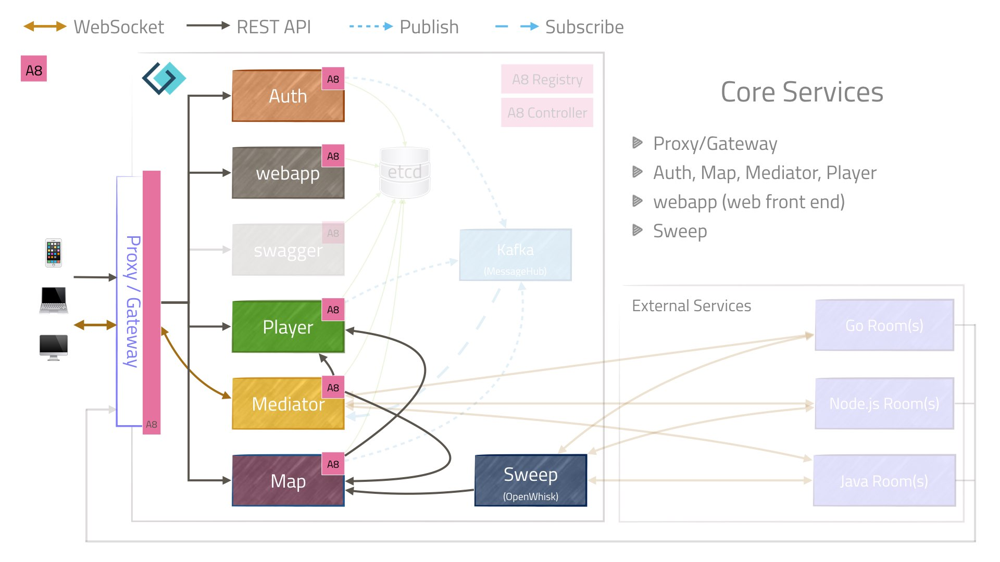
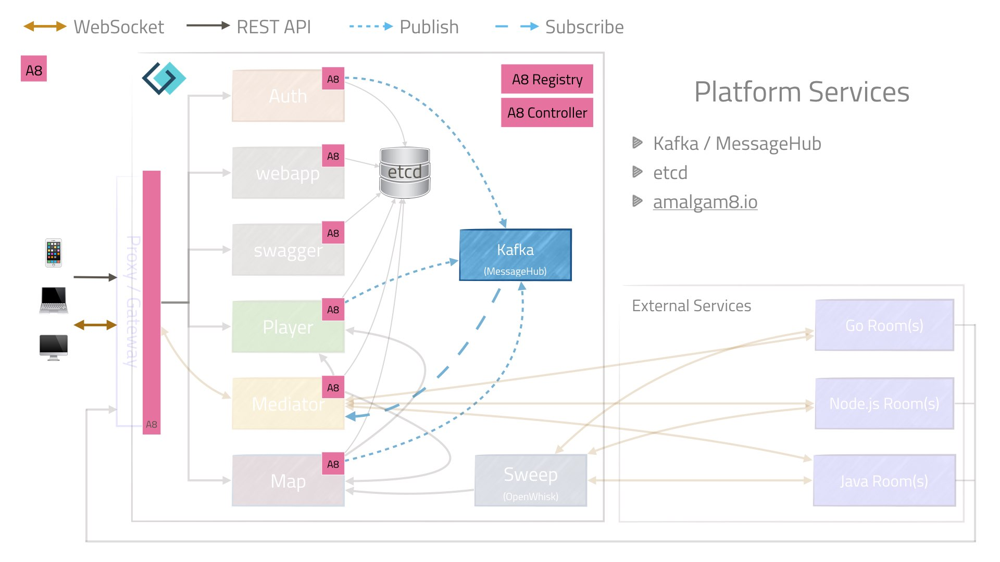
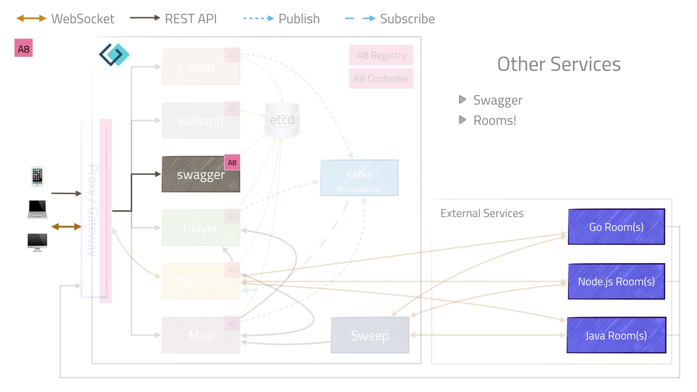

= Application Architecture
:icons: font
:toc:
:toc-title:
:toc-placement: preamble
:toclevels: 2
:chronicles: link:../chronicles/README.adoc
:map: link:Map.adoc
:goroom: https://github.com/gameontext/sample-room-go
:maproom: https://game-on.org/swagger/
:nodejsroom: https://github.com/gameontext/sample-room-nodejs
:recroom: https://github.com/gameontext/gameon-room
:security: link:ApplicationSecurty.adoc
:simpleroom: https://github.com/gameontext/sample-java-room
:swagger: https://game-on.org/swagger/
:WebSocket: link:WebSocketProtocol.adoc
:walkthroughs: link:../walkthroughs/README.adoc

Game On! is an application composed of several microservices. The set of services
has changed over time. The best practice with microservice architectures is still
to start with a monolith or (at least) with very large chunks. We started with two
large blobs, and {chronicles}[refined the granularity of services as the application
evolved].

The core and secondary services are described below, with attention paid to the
characteristics that made each into a standalone, autonomous microservice.

== Core Services

=== Auth

Auth is a very small lightweight authentication system. It allows players to
connect and identify themselves via a selected "social login". We assume that
the client (JavaScript running on a device outside of our environment) is not
secure, so player authentication using OAuth is initiated by the Player service,
rather than by the client/webapp.

This service used to be part of the Player service, when we considered the Player
service to be looking after all things related to the Player. As the application
grew in scope, and we added additional social login providers, it started to become
clear that the Auth aspect of Player was deserving of it's own service. This allowed
us to separate and better manage the various library dependencies of the Auth code
from the persistent store used by Player.

The Auth service hosts an endpoint per supported social login provider, and the
flow goes something like this: the user (that's you), pushes a button in the
web UI to select an OAuth provider (Facebook, Google, GitHub, or Twitter). This
button press sends an async REST request to the Player to initiate the
authentication process. The Player sends a REST request to the selected OAuth
provider using the proper credentials. Many redirects later, we get a callback
from the OAuth provider letting us know that you authenticated properly. We then
{security}[sign a JWT], which is passed back to the client/webapp.

Auth declares itself as an Amalgam8 service on startup, allowing it's discovery by
other services, such as the Proxy/Gateway. Currently Auth makes its calls to the
social login services directly, but we plan to direct these calls through Amalgam8
to better enable testing, and simulate remote failures.

=== Webapp

Webapp is a simple nginx process that serves the static files that comprise the
front-end of the UI. The front-end is a single page application written in
JavaScript that makes requests using standard/published APIs to interact with
backend microservices via the proxy/gateway.

Having this as a separate entity allows our front-end to be changed and updated
independently from other services. Some suggest that UI components should be
provided by each backend service, which can be true with a UI built from distinct
sections. The game, however, uses a more integrated UI, with much of the rendered
data coming from a long-lived {WebSocket}[WebSocket connection using a custom
protocol].

The webapp process has fairly simple scaling requirements, as it serves cachable
static files. It is not (yet) an Amalgam8 service, but we plan to convert it into
one in our next integration pass.

=== Player

Players are represented by the player service, which provides a
{swagger}[public API] for CRUD operations, and for managing API tokens.

The Player service was one of the first to exist, and is implemented in Java
using WebSphere Liberty. It stores data in either couchdb (local) or Cloudant.

The Player service registers as an Amalgam8 service on startup, enabling other
services to find it, and allowing for scaling via additional instances if required.

=== Mediator

Once upon a time, the mediator was part of the player service. It was split into
its own microservice for two reasons: 1) the function it performs is not strictly
related to the notion of a "player", and 2) it has drastically different scaling
requirements.

After a user has logged in, a WebSocket is established between the user's device
and the mediator. The mediator then maintains a second WebSocket connection to
whatever room the player is in. Maintaining two long-lived connections (even with
asynchronous processing going on) will use resources differently than other kinds
of REST or HTTP request processing.

To provide the best user experience it can, the mediator retains cached information
about rooms it has visited, to ensure that players can move between rooms if the
map service can't be reached. It also provides a few special rooms itself (First
Room, Empty Room, and Sick Room) to provide a good user experience in the face
of badly behaved or failing rooms.

The Mediator service is implemented in Java using WebSphere Liberty, it does not
use an external data store. As noted above, its API is a {WebSocket}[WebSocket
endpoint with a custom protocol].

Mediator also registers as an Amalgam8 service, enabling proxy to forward traffic
to it (including the WebSocket from the end user). Requests to Player and Map made
by Mediator are routed via the local in-container Amalgam8 proxy, allowing those
to scale as required.

==== First Room

First Room is the starting place for every player joining the game, and is also
where players return when things go terribly wrong, or when they call for a rescue
(`/sos`). It also provides a few special commands that room implementors can use
to teleport to rooms that they own.

==== Empty Room

Empty rooms act as placeholders: they do nothing interesting, but are navigable
to allow players to navigate the map even when there are holes in it.

==== Sick Room

Sick rooms are also placeholders, but they specifically stand in for rooms that
exist, but are not responsive. They are a game-appropriate implementation of the
circuit breaker pattern: detecting failures and unresponsive rooms, and
preventing repeated access to those rooms until they have been restored.

=== Map

{map}[The Map] maintains a 2-dimensional grid containing all known (registered
and empty) rooms.

The Map service is a Java EE application running on WebSphere Liberty that
provides a {swagger}[public REST API] using JAX-RS. It stores
data in a NoSQL data store, either couchdb or Cloudant. Methods that modify the
map require {security}[signed requests].

Map registers as an Amalgam8 service at startup, enabling Mediator and Proxy to
find it and place invocations to it via their in-container proxies.

=== Sweep

The Sweep performs periodic rounds of all the registered rooms, checking to see
if they are still reachable, and that they behave properly according to the
documented {WebSocket}[WebSocket protocol].

=== Proxy/Gateway

We have a single proxy/gateway that is haproxy based, and is responsible
for surfacing the {swagger}[collection of APIs] as a single facade for
the entire application.

Today this proxy identifies services via url patterns, and where a request is
made to an Amalgam8 registered service, the proxy will place that invocation via
the Amalgam8 in-container proxy. This both provides Service Discovery, and Service
Proxying, allowing the instances of the servce being routed to to scale as required.

== Platform Services

=== Amalgam8 services.

Amalgam8 supplies us a Registry, and a Controller, via which it implements the
Service Discovery, and Service Proxying that we make use of in our core services.

=== Kafka/MessageHub

We have started adding event driven processing to the Game On core services, and
Kafka (also used by Amalgam8) is our chosen Publish/Subscribe solution.

=== etcd

Etcd was added to simplify configuration management. There are many ways to
slice this particular onion, but the important thing for us was being able to see the
configuration attributes used, and in some cases shared, by our core services
in a central place.

The configuration attributes stored in etcd are environment-specific: different
values are provided for different deployment stages using isolated etcd clusters.
Etcd is not used when developing locally, we instead rely on local env files
injected via Docker Compose.

== Other Services

=== Swagger

A simple process that serves the swagger UI with our {swagger}[swagger API documents].

=== Room implementations

We have a few room implementations defined within our repositories.

* {simpleroom}[SimpleRoom] -- foundation for the Java-based walkthrough
* {nodejsroom}[Node.js room] -- foundation for the JavaScript walkthrough
* {goroom}[Go room] -- foundation for the Go walkthrough
* {recroom}[The RecRoom and Basement] -- two related rooms, one of which has items
* {maproom}[The Map room] -- uses the Map's API to display a map of all registered rooms

For most of them, a single service is providing a single room. The notable
exception is the RecRoom and Basement, where a single service is providing two
related rooms.

Each service is responsible for managing its own data (if any), and satisfying the
published APIs for a room to the satisfaction of the Sweep. As mentioned in
{walkthroughs}[Extending the game], rooms are what allow you to
experiment with microservices concepts and approaches. In effect you are building
one microservice (or a subsystem composed of microservices) that becomes one element
of a larger system of services. You can play in and with a microservices
architecture without having to build all of the pieces yourself.
