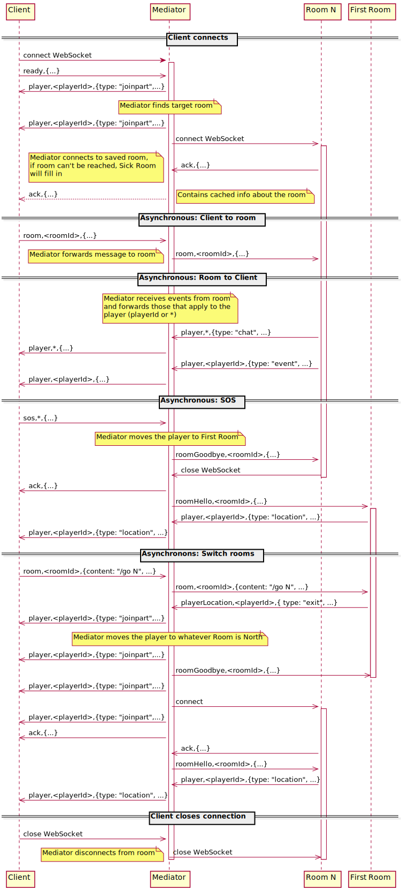

= WebSocket Protocol
:icons: font
:toc:
:toc-title:
:toc-placement: preamble
:toclevels: 3
:swagger: https://game-on.org/swagger/
:security: link:ApplicationSecurty.adoc

WebSockets are currently used for two-way asynchronous communication between the Client
(the player's web browser) and the Mediator, and between the Mediator and a Room.
The Mediator is playing man-in-the-middle, and the goal is to allow as much message
routing as possible to happen without requiring the Mediator to look at the JSON data.

The protocol used by Game On! is text (rather than binary), and uses a simple
comma-delimited header followed by a JSON payload, `just,like,{"this": "ok?"}`.

* The first section, e.g. `just` in the example above, indicates the target
  of the message.
  - `player` is used for messages destined for the player/client.
  - `playerLocation` is interpreted by the Mediator and also sent to the
    player/client.
  - `room*` is used for messages destined for the room.
* The middle section, e.g. `like` in the example above, indicates the recipient
  of the message. This element is not present in all messages.
  - For player-directed messages, it is either the specific player's ID, or `*`
   for messages intended for all players.
  - For room-directed messages, it is the specific room's ID.
* The last section is a JSON payload, e.g. `{"this": "ok?"}`. The contents
  vary by message type.

All message formats are documented below, grouped by the sender. Note that
implementations of a client/front-end or a room need to understand both how to
send required messages, but also how to receive and process messages of different
types that will be sent in their direction. A sequence diagram follows to help
explain the flow of messages.

WebSocket connections between the Mediator and the Room can also be
(security)[signed].

== Messages sent by the Client

=== Client -> Mediator, ready message

----
ready,{
    "roomId": "cached-room-id",
    "bookmark": "id"
}
----

Note that the data in the ready message is what the client had cached. It is
used to determine whether or not history replay applies.

=== Client -> Mediator, sos message

----
sos,*,{
    "username": "username",
    "userId": "<userId>"
    "content": "<message>"
}
----

Help! The SOS message is sent to the mediator by the client on behalf of a
player who is either stuck or bored and just wants a fast-path back to
First Room.

=== Client -> Mediator -> Room, chat/command message

----
room,<roomId>,{
    "username": "username",
    "userId": "<userId>"
    "content": "<message>"
}
----

The target room id is sent as part of the comma-delimited header so that the
mediator can discard the message if it arrives after the player has switched rooms.

The content sent from the client is a single text line (just as the player
entered it). If it begins with `/`, it is a command; if it doesn't, it's just
chatter.

<<<

== Messages sent by the Mediator

=== Mediator -> Client, acknowledgement (ack) message

----
ack,{
    "mediatorId": "assigned-id",
    "roomId": "current-room-id",
    "commands": {
        "/help": "...",
        ...
    }
  }
----

Sent when the connection between the client and the mediator is first established,
and again whenever the player's location changes, as an assist for cache-refreshes.

The commands included in the `ack` are the common commands that are always supported.

=== Mediator -> Client, status messages

----
player,<playerId>,{
    "type": "status",
    "content": "text update"
}
----

These are short messages that the Mediator sends while managing room connections.

=== Mediator -> Room, roomHello message

----
roomHello,<roomId>,{
    "username": "username",
    "userId": "<userId>",
    "version": 1|2,
    "recovery": true|false
}
----

Sent when a player changes location to arrive in the room. The version field
is the version of this WebSocket protocol selected by the mediator based on
the ack sent by the room.

The "recovery" attribute may not be present. If it is present, and `true`, then
the roomHello is happening after recovering from a dropped or failed connection.
Users may or may not be already known to the room.

Supported versions: 1, 2

=== Mediator -> Room, roomGoodbye message

----
roomGoodbye,<roomId>,{
    "username": "username",
    "userId": "<userId>"
}
----

Sent when a player leaves the room to go to another room, e.g. after a `/go *`
or `/sos` command.

=== Mediator -> Room, roomJoin message (version 2)

----
roomJoin,<roomId>,{
    "username": "username",
    "userId": "<userId>",
    "version": 2
}
----

Sent when a player joins or reconnects to a room, e.g. they log back into the
game, as their location is persisted. Think if this as the player becoming
active after being away.

Used in version 2 of the protocol.

=== Mediator -> Room, roomPart message (version 2)

----
roomPart,<roomId>,{
    "username": "username",
    "userId": "<userId>",
}
----

Sent when a player leaves the room without moving to another room, e.g. they
log out, close their browser, or otherwise drop their connection. Think of this
as the player going `away`.

Used in version 2 of the protocol.

<<<

== Messages sent by the Room

Rooms can always broadcast everything to everyone. Use either a specific player
id or `*`in the routing  information to allow downstream filters to direct
traffic appropriately.

=== Room -> Mediator, acknowledgement (ack) with supported versions

This packet should be sent when the WebSocket is opened, and indicates the
possible versions of this WebSocket communication protocol supported by the
room (or rooms) behind this WebSocket endpoint.

----
ack,{
    "version": [1,2]
}
----

The version field is a list of number.

=== Room -> Mediator -> Client, location message

Send information about the room to the client. This message is sent after
receiving a `roomHello`.

----
player,<playerId>,{
    "type": "location",
    "name": "Room name",
    "fullName": "Room's descriptive full name",
    "description", "Lots of text about what the room looks like",
    "exits": {
        "shortDirection" : "currentDescription for Player",
        "N" :  "a dark entranceway"
    },
    "commands": {
        "/custom" : "Description of what command does"
    },
    "roomInventory": ["itemA","itemB"]
}
----

Note: Some attributes, like "exits", "commands", and "roomInventory" can also be
sent with other room events as a pseudo-push notification.

=== Room -> Mediator -> Client, chat messages

----
player,*,{...}
{
  "type": "chat",
  "username": "username",
  "content": "<message>",
  "bookmark": "String representing last message seen"
}
----

Content is a simple string containing the chat message.

The bookmark is used when a client re-joins, to allow missed messages to be
returned to the client when requested. Mechanism for this TBD.

=== Room -> Mediator -> Client, Event message

----
player,<playerId>,{
    "type": "event",
    "content": {
        "*": "general text for everyone",
        "<playerId>": "specific to player"
        },
    "bookmark": "String representing last message seen"
}
player,*,{
    "type": "event",
    "content": {
        "*": "general text for everyone",
        "<playerId>": "specific to player"
    },
    "bookmark": "String representing last message seen"
}
----

Events can be routed specifically to a player, or can be broadcast to everyone.
The content can also be directed to specific users vs. all users. The structure
is the same to make it easier to deal with consistently. Typical patterns would be:

----
player,playerA,{
    "type":"event",
    "content": {"*": "You feel the earth move"},
    "bookmark": "roomName-235"
}

player,*,{
    "type":"event".
    "content": {
        "playerA": "You feel the earth move",
        "*": "playerA looks rather ill"
    },
    "bookmark": "backendTopic-identifier"
}
----

The bookmark is used when a client re-joins, to allow missed messages to be
returned to the client when requested. Mechanism for this TBD.

=== Room -> Mediator -> Client, playerLocation message

Indicates that a player can leave by the requested exit (`exitId`). The `exit`
attribute, if present, should return the exit details as returned by the map API.
The `exit` attribute is not required, but must be present if the details to be
used are not present in the map (i.e. this is how you make up and down work).

----
playerLocation,<playerId>,{
    "type": "exit",
    "content": "You exit through door xyz... ",
    "exitId": "N"
    "exit": { ... }
}
----

This must be directed to a specific player.

<<<

== Sequence diagram

This diagram won't win any design competitions, but it does give a general idea
the way messages flow between the Client, the Mediator, and Rooms.

Additional notes:

* First Room is part of the Mediator. It obeys the WebSocket protocol in terms
  of messages sent back and forth, but communication with First Room does not
  occur over a WebSocket.
