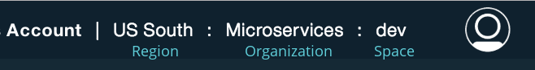

= Deploying to IBM Bluemix as Cloud Foundry application
:icons: font
:toc:
:toc-title:
:toc-placement: preamble
:toclevels: 2

{empty}

== Prerequisites for Bluemix deployment

- https://console.ng.bluemix.net[Bluemix account] / https://console.ng.bluemix.net/docs/admin/account.html[Signing up for Bluemix]
- https://docs.cloudfoundry.org/cf-cli/[Cloud Foundry command line]

[NOTE]
.Some notes about your Bluemix account
====
After you've logged into Bluemix on the web, your active region,
organization, and space are shown in the top right-hand corner.
You'll need these three values in the following steps.

See the https://console.ng.bluemix.net/docs/admin/orgs_spaces.html[Bluemix
documentation] for more information on Bluemix organizations and spaces.
====

== Log in using the `cf` command

Login to Bluemix via the command line:

    cf login

  - Enter Bluemix API endpoint (for your region):
    * US South: `https://api.ng.bluemix.net`
    * London: `https://api.eu-gb.bluemix.net`
  - Enter email and password for Bluemix login
    * If logging in with a federated ID (if you don't know what this means,
      you aren't), use the `-sso` option with a
      https://login.ng.bluemix.net/UAALoginServerWAR/passcode[one-time use password]
  - Choose a Bluemix organization by number
  - Choose a Bluemix space by number

== Deploy your application

1. `cf push <cf-app-name> -p <app archive>`
  - Choose a unique app name. This will be used as the first part of the URL, e.g. `cf-app-name` becomes `cf-app-name.mybluemix.net`
  - For `sample-room-java`, the app archive is `target/gameon-room-java.zip`
  - See: https://console.ng.bluemix.net/docs/manageapps/depapps.html#dep_apps[Deploying applications by using the cf command]

2. After your room has been pushed, you should be able to view it at:
  - US South: `http://<cf-app-name>.mybluemix.net/`
  - United Kingdom: `http://<cf-app-name>.eu-gb.mybluemix.net/`
